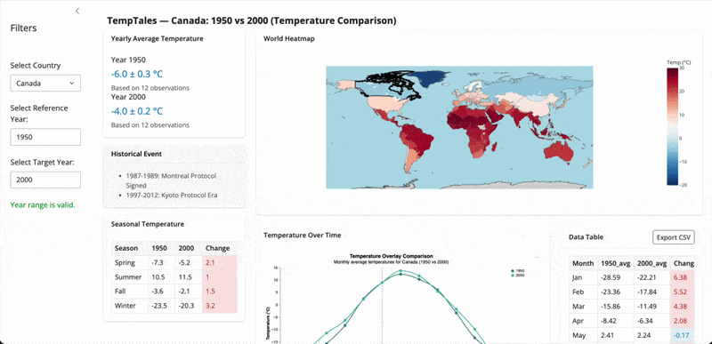

# TempTales: Climate Change Explorer Dashboard

| | |
| :--- | :--- |
| **License** | [](LICENSE) |
| **Python** | [](https://www.python.org/downloads/) |
| **Status** | [](https://github.com/ubc-mds/dsci-532_2026_26_tbd) |

## Overview

**TempTales** is an interactive dashboard that allows users to explore global and country-level temperature trends over time while connecting these trends to major historical events. Users can select a country, view seasonal and monthly temperature patterns, and see how significant events like industrialization or world wars align with temperature changes. A world heatmap provides a spatial view of temperatures for selected years, making regional patterns immediately clear. This tool consolidates climate data from 1860-2012 into a user-friendly interface for researchers, students, policy makers, and environmentally conscious individuals.

Deployed Dashboard URL: https://019c9116-f7e7-177d-42c7-e2e3b140264c.share.connect.posit.cloud

## Table of Contents

- [TempTales: Climate Change Explorer Dashboard](#temptales-climate-change-explorer-dashboard)
  - [Table of Contents](#table-of-contents)
  - [For Users](#for-users)
    - [Features](#features)
    - [Demo](#demo)
  - [For Contributors](#for-contributors)
    - [Project Directory Structure](#project-directory-structure)
    - [Installation](#installation)
    - [Usage (Makefile Guide)](#usage-makefile-guide)
      - [Initialization](#initialization)
      - [Running the App](#running-the-app)
      - [Cleaning Data](#cleaning-data)
    - [Developer Setup](#developer-setup)
    - [Contributing](#contributing)
  - [Contributors](#contributors)
  - [Copyright](#copyright)


## For Users

**TempTales** is an interactive dashboard that allows users to explore global and country-level temperature trends over time while connecting these trends to major historical events. Users can select a country, view seasonal and monthly temperature patterns, and see how significant events like industrialization or world wars align with temperature changes. A world heatmap provides a spatial view of temperatures for selected years, making regional patterns immediately clear. This tool consolidates climate data from over two centuries into a user-friendly interface for researchers, students, policy makers, and environmentally conscious individuals.

Rendered Dashboard links: 
- main branch: https://019c9116-f7e7-177d-42c7-e2e3b140264c.share.connect.posit.cloud
- dev branch: https://019c9879-5ec6-dc91-2d43-ec77c0e6fdac.share.connect.posit.cloud

### Features

- **Country selection** – Explore temperature data for any country in the dataset
- **Two-year comparison** – Compare baseline vs. target year with validated year inputs
- **Monthly dual-line chart** – Altair overlay of monthly average temperatures (Jan–Dec) with hover tooltips and vertical rule
- **Data table** – Monthly comparison table with red/blue color coding for change magnitude; CSV export
- **World heatmap** – Choropleth map of global temperatures for the selected target year
- **Seasonal & historical context** – Seasonal temperature breakdown and historical event labels

### Demo



## For Contributors

### Project Directory Structure

The core logic of the project is located in the `src/` directory.

```text
├── data/                   # Data storage
│   ├── raw/                # Raw data (downloaded via make)
│   ├── processed/          # Processed pickle files (generated via make)
│   └── figures/            # Static analysis figures
├── img/                    # Images used in README (e.g., sketches)
├── notebooks/              # Jupyter Notebooks for EDA and prototyping
├── reports/                # Project proposals and reports
├── src/                    # Source code
│   ├── __init__.py         # Marks src as a Python package
│   ├── app.py              # Main entry point for the Shiny App; server logic
│   ├── data_count.py       # Data summary/count helper functions
│   ├── data_loader.py      # Script to download and update the database
│   ├── data_processor.py   # Script to clean and transform data
│   ├── map.py              # Map-building logic for geographic visualizations
│   ├── plot.py             # Altair chart builder for monthly  temperature
│   ├── ui.py               # Frontend layout, inputs, and page assembly
│   └── utils.py            # Data loading, pre-aggregation (yearly, seasonal, monthly), global UI config
├── CHANGELOG.md            # Record of notable project changes
├── CODE_OF_CONDUCT.md      # Community and collaboration expectations
├── CONTRIBUTING.md         # Contribution guidelines for collaborators
├── LICENSE                 # Project license
├── Makefile                # Project automation scripts
├── README.md               # Main project documentation
├── description.md          # Project description and assignment context
├── environment.yml         # Conda environment configuration
├── link-to-release.ipynb   # Notebook for release-related deliverables
├── requirements.txt        # Python package dependencies
└── team.txt                # Team member information

```

### Installation

This project uses `conda` for dependency management. Ensure you have Anaconda or Miniconda installed.

```bash
# Clone the repository
$ git clone https://github.com/UBC-MDS/DSCI-532_2026_26_TempTales.git

# Navigate to the project directory
$ cd DSCI-532_2026_26_TempTales

# Create the environment using Makefile
$ make install
```

### Configure GitHub API Key

Some features of the dashboard (like the AI Assistant or QueryChat) require access to GitHub’s API. To set it up:

1. Sign up at <https://github.com/marketplace/models> to get an API key.
2. In your project root, create a .env file if it doesn’t exist.
3. Add your GitHub API key to .env:

```bash
GITHUB_API_KEY=your_github_api_key_here
```

### Usage (Makefile Guide)

This project uses `make` to automate common tasks. Below is a guide to the available commands:

#### Initialization

Before running the app for the first time, you must download and process the data:

```bash
$ make db
```

This command runs `src/data_loader.py` to download the data and `src/data_processor.py` to convert it into the required format.

#### Running the App

To start the **Shiny** app in development mode:

```bash
$ make run
```

This enables reload mode (auto-restart on file save) and automatically launches the app in your browser.

#### Cleaning Data

If you need to reset the data environment (delete all raw and processed data files):

```bash
$ make clean
```

**Note**: This command will prompt for confirmation (`y/N`) to prevent accidental deletion.

### Developer Setup

If you wish to contribute to the project, please follow these steps:

1. Clone the repository to your local machine.
2. Create the conda environment: `make install`.
3. Activate the environment: `conda activate 532_project`.
4. Run the app locally using `make run` to test changes.

### Running the Tests

#### Prerequisites

Ensure you have the required packages installed:

```bash
pip install pytest playwright pytest-playwright
playwright install
```

#### All Tests (single command)

```bash
pytest tests/ -v
```

#### Unit Tests

Test core logic functions in isolation (no app required):

```bash
# Run all unit tests
pytest tests/ -v

# Run a single test file
pytest tests/test_plot.py -v
```

#### UI Tests (Playwright)

Test the running dashboard in a real browser.
**The app must not already be running on port 8000.**

```bash
# Run on all browsers (Chromium, Firefox, WebKit) — 18 tests total
pytest tests/test_ui_playwright.py -v

# Run on a single browser only
pytest tests/test_ui_playwright.py -v -k "chromium"
pytest tests/test_ui_playwright.py -v -k "firefox"
pytest tests/test_ui_playwright.py -v -k "webkit"
```

To watch the tests run live in a visible browser window, use the
`--headed` flag with `--slowmo` to slow things down enough to follow:

```bash
# Watch on Firefox, 1.5 seconds between each action
pytest tests/test_ui_playwright.py -v -k "firefox" --slowmo 1500 --headed
```

#### Test Coverage Summary

| File | Function tested | Tests |
|---|---|---|
| `tests/test_data_preprocessor.py` | `get_season()` | 13 |
| `tests/test_data_count.py` | `data_count_prep()` | 9 |
| `tests/test_table_styles.py` | `table_styles_wide()`, `diverging_styles()` | 9 |
| `tests/test_map.py` | `apply_country_highlight()` | 9 |
| `tests/test_plot.py` | `build_temp_chart()` | 9 |
| `tests/test_ui_playwright.py` | Full dashboard UI (3 browsers) | 18 |

### Contributing

Contributors are expected to follow the guidelines outlined in **[CONTRIBUTING.md](./CONTRIBUTING.md)**. Please review this document before submitting issues or pull requests.

## Contributors

Emily Jin, Ian Gault, Purity Jangaya, Yusheng Li

## Copyright

- Copyright © 2026 Emily Jin, Ian Gault, Purity Jangaya, Yusheng Li.
- Free software distributed under the [MIT License](./LICENSE).
