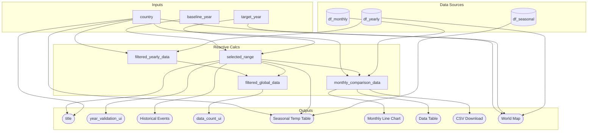

### 2.1 Updated Job Stories

Review your M1 job stories in light of your deployment setup and any new insights. Update or add stories as needed, and track their status:

| #   | Job Story                       | Status         | Notes                         |
| --- | ------------------------------- | -------------- | ----------------------------- |
| 1   | When I select a country and year, I want to view its seasonal and monthly temperature trends so I can analyze climate patterns over time. | ✅ Implemented |   Converted directly from M1 user story 1.                            |
| 2   | When I view a selected year, I want to see historical events associated with it so I can contextualize unusual temperature trends. | 🔄 Revised     | Original phrasing “see historical events” updated to emphasize context for anomalies. |
| 3   | When I select a country and year, I want to visualize a world heatmap showing its temperature so I can compare regional and global patterns. | ✅ Implemented  |   Heatmap rendering and global comparison implemented.                            |
| 4   |When I explore the world heatmap, I want to see the selected country highlighted so I can quickly identify it among global data. | ✅ Implemented |                              |
| 5   | When I select a country on the heatmap, I want it to zoom in on the selected country so I can focus on its local temperature patterns. | ⏳ Pending M3 |   Zoom functionality not yet implemented; planned for next milestone.                            |
| 6   | When I select two years for a country, I want to compare seasonal temperature changes side by side so I can analyze warming or cooling trends. | ✅ Implemented |                              |
| 7   | When I open the dashboard, I want to see a compact, informative title showing country, years, and “Temp Comparison” so I can immediately understand the view. | ✅ Implemented |                              |
| 8   | When I select two years for a country, I want to view a monthly dual-line overlay of average temperatures so I can compare seasonal warming or cooling patterns month by month. | ✅ Implemented | Altair line chart; smooth curves, tooltip, hover rule, legend. |
| 9   | When I view the monthly comparison, I want to see a table with baseline/target averages and change values, with color coding for the magnitude of change, so I can quickly identify which months warmed or cooled and export the data. | ✅ Implemented | Red (warmer) / blue (cooler) on Change column; CSV export. |

### 2.2 Component Inventory

Plan every input, reactive calc, and output your app will have. Use this as a checklist during Phase 3. Minimum **2 components per team member** (6 for a 3-person team, 8 for a 4-person team), with **at least 2 inputs and 2 outputs**:

| ID                    | Type          | Shiny widget / renderer | Depends on                          | Job story(s)       |
| --------------------- | ------------- | ----------------------- | ----------------------------------- | ------------------ |
| `input_country`       | Input         | `ui.input_select()`     | —                                   | #1, #3, #4, #5, #6 |
| `baseline_year`       | Input         | `ui.input_numeric()`    | —                                   | #1, #6             |
| `target_year`         | Input         | `ui.input_numeric()`    | —                                   | #1, #6             |
| `selected_range`      | Reactive calc | `@reactive.Calc`        | `baseline_year`, `target_year`      | #1, #6             |
| `filtered_yearly_data`     | Reactive calc | `@reactive.Calc`        | `input_country`                     | #1                 |
| `filtered_global_data`     | Reactive calc | `@reactive.Calc`        | `filtered_yearly_data`, `selected_range` | #1, #6             |
| `monthly_comparison_data`  | Reactive calc | `@reactive.Calc`        | `input_country`, `selected_range`, `df_monthly` | #1, #8, #9         |
| `year_validation_ui`  | Output        | `@render.ui`            | `selected_range`                    | #1, #6             |
| `temp_plot`           | Output        | `@render_altair`        | `monthly_comparison_data`                | #1, #8             |
| `seasonal_temp_ui`    | Output        | `@render.data_frame`    | `input_country`, `selected_range`, `df_seasonal` | #1, #6             |
| `data_count_ui`       | Output        | `@render.ui`            | `filtered_global_data`                   | #1, #6             |
| `event_ui`            | Output        | `@render.ui`            | `selected_range`                    | #2                 |
| `title_placeholder`   | Output        | `@render.ui`            | `input_country`, `selected_range`   | #7                 |
| `map_plot`            | Output        | `@render_widget`        | `df_yearly` (target year), `input_country`, `selected_range` | #3, #4, #5         |
| `data_table`          | Output        | `@render.data_frame`    | `monthly_comparison_data`                | #1, #9             |
| `download_table_csv`  | Output        | `@render.download`      | `monthly_comparison_data`                | #1, #9             |

### 2.3 Reactivity Diagram

### 2.4 Calculation Details

For each `@reactive.calc` in your diagram, briefly describe:

- Which inputs it depends on.
- What transformation it performs (e.g., "filters rows to the selected year range and region(s)").
- Which outputs consume it.

| Reactive Calc         | Depends on                          | Transformation / Logic                                                                                       | Consumed by / Outputs                                            |
| --------------------- | ----------------------------------- | ------------------------------------------------------------------------------------------------------------ | ---------------------------------------------------------------- |
| `selected_range`      | `baseline_year`, `target_year`      | Validates year inputs and returns `(baseline_year, target_year, error_flag)`. Rejects if target ≤ baseline.   | `monthly_comparison_data`, `filtered_global_data`, `year_validation_ui`, `event_ui`, `title_placeholder` |
| `filtered_yearly_data`     | `input_country`                     | Filters `df_yearly` by selected country.                                                                     | `filtered_global_data` only                                           |
| `filtered_global_data`     | `filtered_yearly_data`, `selected_range` | Filters `filtered_yearly_data` by year in [baseline, target]. Yearly avg data for both years.                     | `data_count_ui` only (map uses `df_yearly` directly for target year) |
| `monthly_comparison_data`  | `input_country`, `selected_range`, `df_monthly` | Filters `df_monthly` by country and both years; merges baseline/target; adds Month, Change (red/blue semantics). | `temp_plot`, `data_table`, `download_table_csv`                  |
