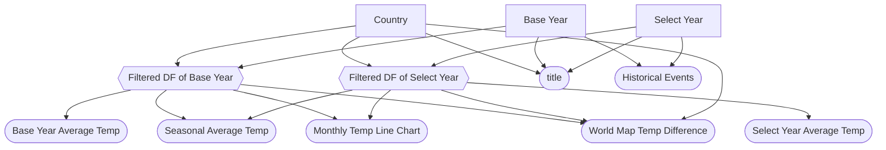

### 2.1 Updated Job Stories

Review your M1 job stories in light of your deployment setup and any new insights. Update or add stories as needed, and track their status:

| #   | Job Story                       | Status         | Notes                         |
| --- | ------------------------------- | -------------- | ----------------------------- |
| 1   | When I select a country and year, I want to view its seasonal and monthly temperature trends so I can analyze climate patterns over time. | ✅ Implemented |   Converted directly from M1 user story 1.                            |
| 2   | When I view a selected year, I want to see historical events associated with it so I can contextualize unusual temperature trends. | 🔄 Revised     | Original phrasing “see historical events” updated to emphasize context for anomalies. |
| 3   | When I select a country and year, I want to visualize a world heatmap showing its temperature so I can compare regional and global patterns. | ✅ Implemented  |   Heatmap rendering and global comparison implemented.                            |
| 4   |When I explore the world heatmap, I want to see the selected country highlighted so I can quickly identify it among global data. | ✅ Implemented |                              |
| 5   | When I select a country on the heatmap, I want it to zoom in on the selected country so I can focus on its local temperature patterns. | ⏳ Pending M3 |   Zoom functionality not yet implemented; planned for next milestone.                            |
| 6   | When I select two years for a country, I want to compare seasonal temperature changes side by side so I can analyze warming or cooling trends. | ✅ Implemented |                              |
| 7   | When I open the dashboard, I want to see a compact, informative title showing country, years, and “Temp Comparison” so I can immediately understand the view. | ✅ Implemented |                              |

### 2.2 Component Inventory

Plan every input, reactive calc, and output your app will have. Use this as a checklist during Phase 3. Minimum **2 components per team member** (6 for a 3-person team, 8 for a 4-person team), with **at least 2 inputs and 2 outputs**:

| ID                    | Type          | Shiny widget / renderer | Depends on                          | Job story(s)       |
| --------------------- | ------------- | ----------------------- | ----------------------------------- | ------------------ |
| `input_country`       | Input         | `ui.input_select()`     | —                                   | #1, #3, #4, #5, #6 |
| `baseline_year`       | Input         | `ui.input_numeric()`    | —                                   | #1, #6             |
| `target_year`         | Input         | `ui.input_numeric()`    | —                                   | #1, #6             |
| `selected_range`      | Reactive calc | `@reactive.Calc`        | `baseline_year`, `target_year`      | #1, #6             |
| `filtered_yearly`     | Reactive calc | `@reactive.Calc`        | `input_country`                     | #1, #3             |
| `filtered_global`     | Reactive calc | `@reactive.Calc`        | `filtered_yearly`, `selected_range` | #3, #4, #5         |
| `monthly_comparison`  | Reactive calc | `@reactive.Calc`        | `filtered_yearly`, `selected_range` | #1                 |
| `seasonal_comparison` | Reactive calc | `@reactive.Calc`        | `filtered_yearly`, `selected_range` | #1, #6             |
| `temp_plot`           | Output        | `@render_altair`        | `monthly_comparison`                | #1                 |
| `seasonal_temp_ui`    | Output        | `@render.data_frame`    | `seasonal_comparison`               | #1, #6             |
| `data_count_ui`       | Output        | `@render.ui`            | `filtered_global`                   | #1, #6             |
| `event_ui`            | Output        | `@render.ui`            | `selected_range`                    | #2                 |
| `title_placeholder`   | Output        | `@render.ui`            | `input_country`, `selected_range`   | #7                 |
| `map_plot`            | Output        | `@render_widget`        | `filtered_global`                   | #3, #4, #5         |
| `data_table`          | Output        | `@render.data_frame`    | `monthly_comparison`                | #1                 |
| `download_table_csv`  | Output        | `@render.download`      | `monthly_comparison`                | #1                 |

### 2.3 Reactivity Diagram

### 2.4 Calculation Details

For each `@reactive.calc` in your diagram, briefly describe:

- Which inputs it depends on.
- What transformation it performs (e.g., "filters rows to the selected year range and region(s)").
- Which outputs consume it.

| Reactive Calc         | Depends on                          | Transformation / Logic                                                                                       | Consumed by / Outputs                                            |
| --------------------- | ----------------------------------- | ------------------------------------------------------------------------------------------------------------ | ---------------------------------------------------------------- |
| `selected_range`      | `baseline_year`, `target_year`      | Calculates the selected year range and validates it. Returns `(baseline_year, target_year, error_flag)`      | `monthly_comparison`, `seasonal_comparison`, `title_placeholder` |
| `filtered_yearly`     | `input_country`                     | Filters the main temperature dataset for the selected country.                                               | `monthly_comparison`, `seasonal_comparison`, `filtered_global`   |
| `filtered_global`     | `filtered_yearly`, `selected_range` | Combines filtered yearly data with selected range to produce a dataset suitable for world heatmap comparison | `map_plot`, `data_count_ui`                                      |
| `monthly_comparison`  | `filtered_yearly`, `selected_range` | Computes monthly temperature statistics for both baseline and target years, used for plotting trends         | `temp_plot`, `data_table`, `download_table_csv`                  |
| `seasonal_comparison` | `filtered_yearly`, `selected_range` | Calculates seasonal averages for baseline and target years and computes changes                              | `seasonal_temp_ui`, `data_count_ui`                              |
